<div align="center">


# Voyager

**Where you went, worked out on your phone.**

Voyager reconstructs your day from raw GPS — where you stopped, how long you stayed, how you
travelled between places — without a Maps API key, without an account, and without a single byte
leaving the device.

[](https://kotlinlang.org)
[](https://developer.android.com/jetpack/compose)
[](https://developer.android.com/tools/releases/platforms)
[](https://developer.android.com/tools/releases/platforms)
[](#building)
[](#two-builds-one-codebase)

[Live site](https://okayanshul.github.io/voyager-site/) ·
[Case study](docs/CASE_STUDY.md) ·
[Features](docs/FEATURES.md) ·
[Privacy](docs/privacy-policy.md)

</div>

<div align="center">

### The six tabs

| Today | Timeline | Map |
|:---:|:---:|:---:|
| 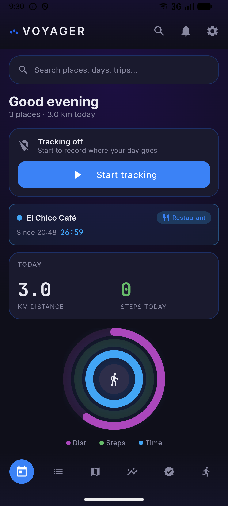 | 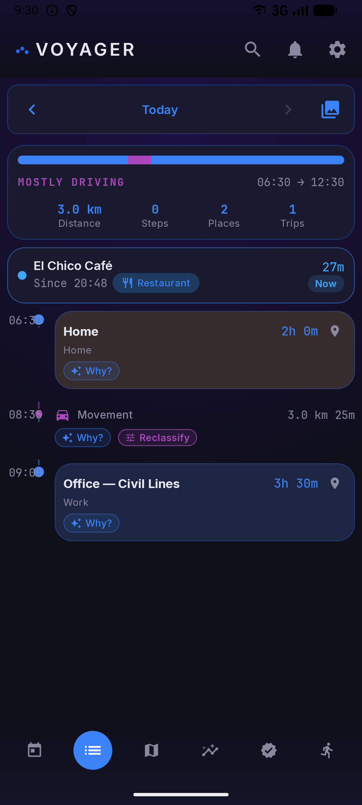 | 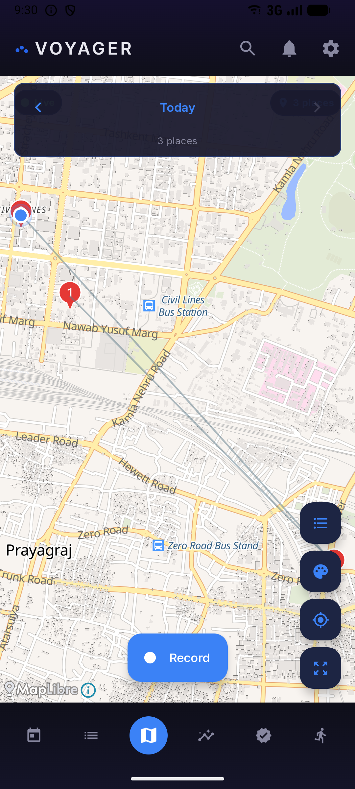 |
| Live tracking, today's stats, anomalies | Visits and movements in order, gaps included | Routes and markers, synced to the timeline |

| Insights | Proof | Activities |
|:---:|:---:|:---:|
| 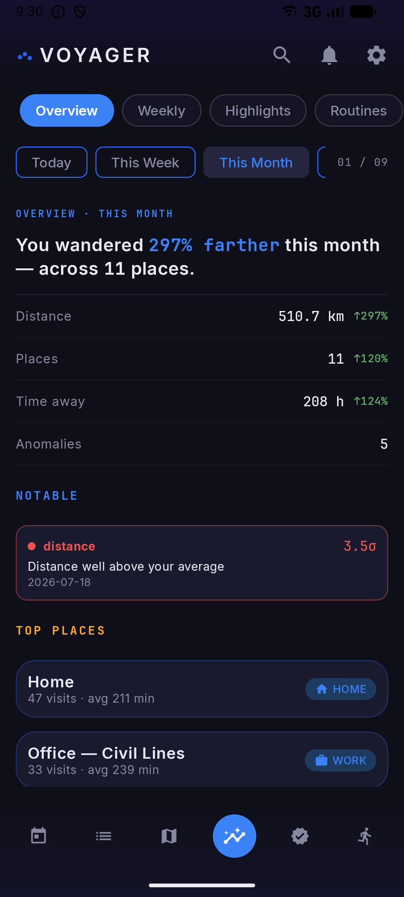 |  | 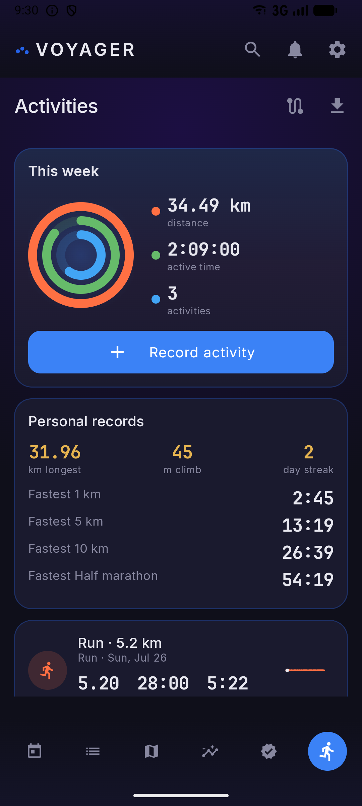 |
| Nine lenses, told as a storybook | Audit-ready records, computed on-device | Rings, workout feed, segments |

### Insights, lens by lens

| Weekly | Routines | Carbon |
|:---:|:---:|:---:|
| 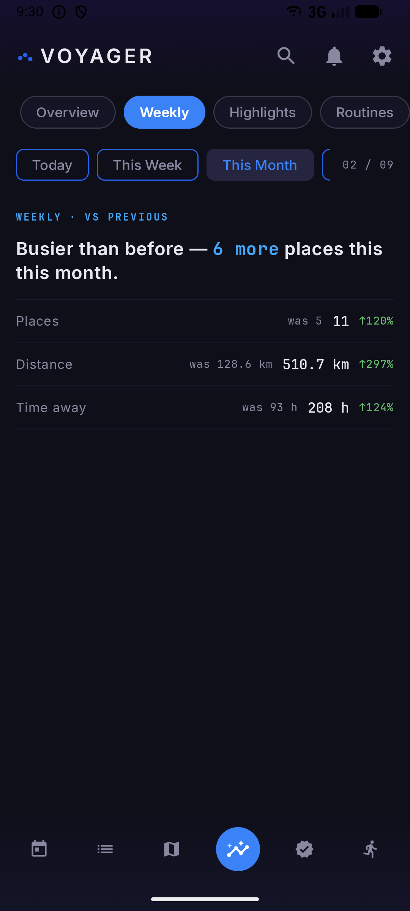 | 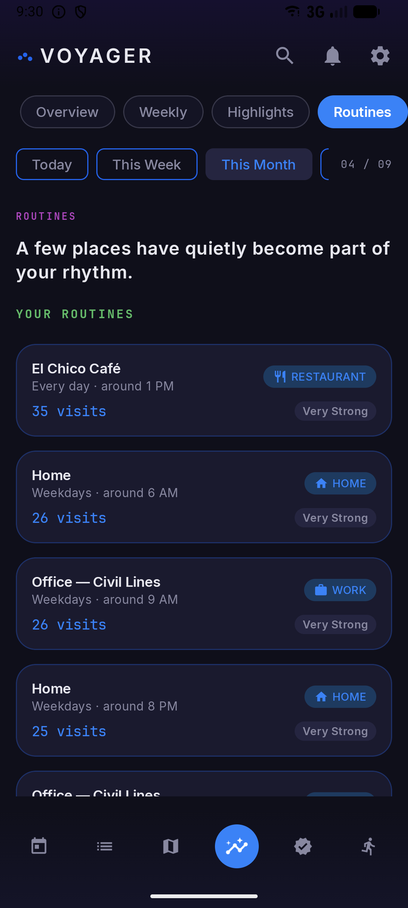 | 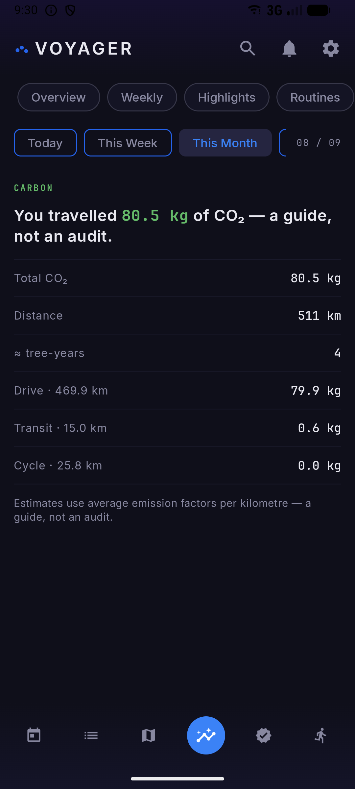 |
| This week vs last, and your streak | Routines it has learned, in plain words | Estimated CO₂ by travel mode |

### Records and detail

| Mileage | Trips | Activity detail | Splash |
|:---:|:---:|:---:|:---:|
| 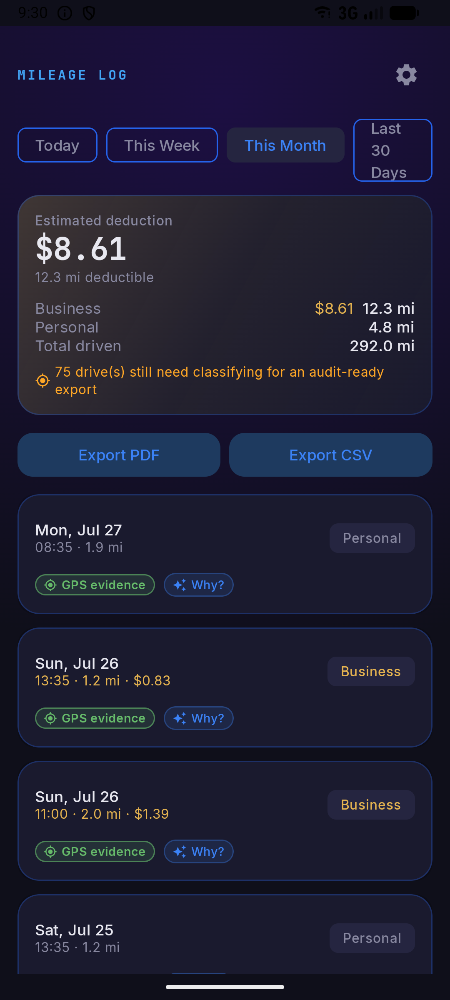 |  | 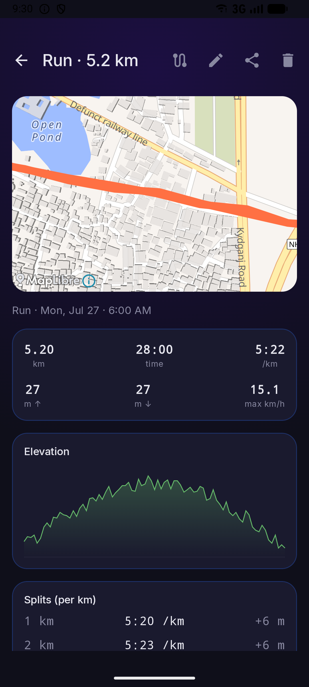 |  |
| Drives classified, with deductible value | Multi-day journeys, auto-detected | Splits and elevation profile | — |

</div>

---

## The problem

A phone knows where it is several times a minute. It does **not** know that you were at work, that
you walked to the station, or that Tuesday was unusual. Between a stream of noisy coordinates and
"you spent four hours at the office" sits every hard problem in this app: GPS jitter, tunnels,
battery, indoor drift, spoofing, and the fact that a stop and a traffic jam look identical to a
sensor.

Voyager is the pipeline that closes that gap, running entirely on the device.

## What happens to a single GPS fix

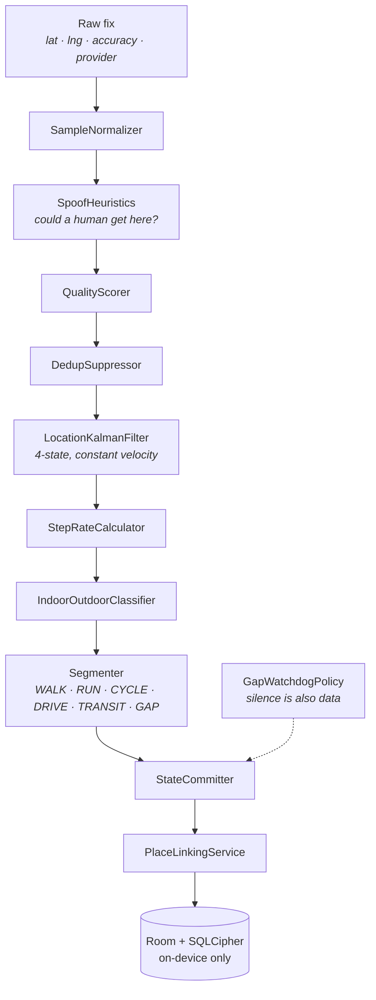

Nine stages, one consumer. Everything funnels through a single `Channel` with a state-commit
mutex, so no two stages can ever interleave a write — the classic failure mode for sensor
pipelines, where a visit is committed while the segmenter is still deciding whether it was one.

---

## What you actually get

Six tabs, behind a first-run flow — Splash → Intro → Permissions → Persona → Main — where the
persona (Everyday, Commuter or Athlete) sets your default tracking preset.

| Tab | What lives there |
|---|---|
| **Today** | Live tracking control, today's stats, top places, insight teasers, anomaly flags |
| **Timeline** | The day as visits and movements, in order, with honest gaps |
| **Map** | Dark cartographic OSM map — the day's routes and visit markers, synced to the timeline |
| **Insights** | Nine analytics lenses, told as a storybook |
| **Proof** | Evidence hub — mileage, trips and export, framed as audit-ready records |
| **Activities** | Athlete home — activity rings, workout feed, record button, segments |

Plus global search, a review-bell for places awaiting confirmation, and settings.

### Tracking

| Feature | Detail |
|---|---|
| **Adaptive sampling** | 90 s still · 10 s moving · 15 s charging, scaled ×0.5 / ×1.0 / ×2.0 by preset |
| **Dormancy** | GPS stands down when you stop, with an entry threshold and a two-minute exit grace so it cannot thrash at the boundary |
| **Segmentation** | WALK · RUN · CYCLE · DRIVE · TRANSIT · GAP |
| **Visit detection** | Dwell-based, committed through a single serialized channel |
| **Honest gaps** | An explicit GAP row when tracking was interrupted, rather than a faked smooth line |
| **Spoof resistance** | Teleport detection beyond the OS mock-provider flag |
| **Places** | Geocoded via OpenStreetMap and Nominatim; renameable, re-categorisable, with a correction workflow |

### Insights — nine lenses

**Overview** (period summary) · **Weekly** (this week vs last, plus your streak) ·
**Highlights** (records and "on this day") · **Patterns** (learned routines with human labels) ·
**Rhythm** (day rhythm, sleep windows, routine breaks) · **Movement** (place stats and an
exploration score) · **Balance** (a time budget across life categories) · **Carbon** (estimated
CO₂ by travel mode) · **Anomalies** (days that do not fit).

Behind them: commute analysis, next-place prediction, a heatmap and a Year-in-Review.

### Activities

A private, on-device analogue to a fitness tracker. Live recorder for run, walk, cycle and hike
with a route map. **Auto-pause**, so traffic lights do not dilute your pace. Elevation gain with a
hysteresis band to reject jitter. Per-kilometre splits and an elevation profile. Personal records.
And **race-yourself segments** — save a stretch, and efforts are matched against your own recorded
activities on the fly. No leaderboard, no cloud. Any activity exports as GPX.

### Proof — mileage, trips, export

| Feature | Detail |
|---|---|
| **Mileage log** | Classify drives (business / personal / medical) with deductible value from configurable IRS- or HMRC-style rates, in your currency |
| **Vehicles** | Fuel type and efficiency drive fuel-cost and CO₂ estimates, with automatic drive attribution |
| **Evidence-backed** | Every row carries the GPS trace and rule version that produced it, so the log survives scrutiny |
| **Trips** | Auto-detected multi-day journeys away from home, each opening as a shareable story |
| **Export** | Voyager JSON, GPX, GeoJSON, CSV |
| **Import** | **Google Timeline JSON**, GPX, and full `.voyager` restore |

### Also

A **photo day story** pinning your device's own photos (MediaStore + EXIF, read on-device) to the
places you visited. Full-text search across places and days, with date, category and mode filters.
And every inference is explainable — any timeline row can say why it was classified that way,
including the counter-evidence.

**Every feature is free.** There is no paid tier.
→ Full catalogue in **[docs/FEATURES.md](docs/FEATURES.md)**

---

## Engineering

**68,099 lines of Kotlin across 520 files** — 413 main, **107 test**.

| Area | What's there |
|---|---|
| **Pipeline** | 9 stages behind one serialized channel; pure, injectable, individually unit-tested |
| **Persistence** | Room with **SQLCipher from the first commit** · 31 entities · 30 DAOs |
| **Maps** | OSMDroid over OpenStreetMap — **no Google Maps API key**, so no billing account and no third party watching |
| **Power** | Adaptive sampling driven by motion state, plus dormancy and a post-dormant settle window |
| **Integrity** | Spoof detection beyond the OS mock flag; a gap watchdog that records what *wasn't* observed |
| **Distribution** | Two flavours — Play and **F-Droid**, which forces the dependency graph to stay free of proprietary libraries |
| **Tests** | **653 tests across 102 files**, green on both flavours in debug and release |

---

## Five decisions worth defending

### Detecting spoofing the OS misses

`Location.isFromMockProvider` only catches apps that go through Android's official mock-location
API. Rooted-device injectors feed coordinates *without* setting that flag. The tell they leave is
**teleportation** — fixes at a normal cadence, at coordinates no body could have reached.

The threshold is **340 m/s, roughly Mach 1**, deliberately far above a jet's ~250 m/s cruise so
real flights never trip it. It ignores sub-second deltas (too noisy to judge) and deltas over ten
minutes (the two fixes straddle a tracking gap, so the implied speed is meaningless). Conservative
on purpose: the rare false positives it does drop are gross GPS glitches, which are samples you
would not want anyway.
→ [`SpoofHeuristics.kt`](app/src/main/java/com/cosmiclaboratory/voyager/pipeline/stage/SpoofHeuristics.kt)

### Recording the silence, not just the signal

A stretch with no samples is ambiguous: the phone was off, or in a tunnel, or tracking broke. Most
apps interpolate straight through it and quietly invent a journey. Voyager writes an explicit
**GAP** instead — but only when active GPS was genuinely running, the silence exceeded both five
times the expected cadence *and* a ten-minute floor, and it isn't the post-dormant window where
GPS is still warming up.

Saying "I don't know what happened here" is more useful than a confident straight line.
→ [`GapWatchdogPolicy.kt`](app/src/main/java/com/cosmiclaboratory/voyager/pipeline/GapWatchdogPolicy.kt)

### A Kalman filter instead of averaging

Four-state — position and velocity, `[x, y, vx, vy]` on a local tangent plane, constant-velocity
process model. It removes 5–15 m of jitter, but the reason it earns its complexity is the
*derived* outputs: velocity-based speed is more stable than the GPS speed field, and
velocity-based bearing is continuous, where raw GPS bearing needs movement to mean anything at
all. Large innovations are weighted down, so outliers dampen themselves.
→ [`LocationKalmanFilter.kt`](app/src/main/java/com/cosmiclaboratory/voyager/pipeline/stage/LocationKalmanFilter.kt)

### Sampling that follows what you're doing

**90 s when still, 10 s when moving, 15 s on charger**, scaled by a user-chosen preset
(×0.5 high accuracy, ×1.0 balanced, ×2.0 battery saver). Below that sits a dormant state with an
entry threshold and a two-minute exit grace, because the expensive mistake is not sampling too
often — it is thrashing between states at a boundary and paying the GPS warm-up cost repeatedly.
→ [`AdaptiveSamplingPolicy.kt`](app/src/main/java/com/cosmiclaboratory/voyager/capture/AdaptiveSamplingPolicy.kt)

### A classifier that refuses to decide

The indoor/outdoor classifier returns a probability in `[0..1]` and nothing else — no boolean, no
threshold. Its two callers want different confidence: the segmenter refining RUN → TREADMILL can
afford to be wrong, power management dropping the GPS rate cannot. Baking one threshold into the
classifier would have forced the cautious caller to live with the reckless one's tolerance.
→ [`IndoorOutdoorClassifier.kt`](app/src/main/java/com/cosmiclaboratory/voyager/pipeline/stage/IndoorOutdoorClassifier.kt)

---

## Two builds, one codebase

`play` and `fdroid` flavours share every line of logic. The F-Droid build exists as a constraint
as much as a channel: F-Droid will not package proprietary dependencies, so having it green is a
continuously-enforced proof that the app really does run without Google Play Services or a Maps
key — a claim that is easy to make and easy to quietly break.

---

## If you're reviewing this code

| File | Why |
|---|---|
| [`pipeline/PipelineSerializer.kt`](app/src/main/java/com/cosmiclaboratory/voyager/pipeline/PipelineSerializer.kt) | The whole concurrency story in 40 lines — one channel, one mutex |
| [`pipeline/stage/SpoofHeuristics.kt`](app/src/main/java/com/cosmiclaboratory/voyager/pipeline/stage/SpoofHeuristics.kt) | Pure, stateless, and every constant carries its reasoning |
| [`pipeline/GapWatchdogPolicy.kt`](app/src/main/java/com/cosmiclaboratory/voyager/pipeline/GapWatchdogPolicy.kt) | Policy extracted from the coroutine loop precisely so it can be tested |
| [`pipeline/stage/Segmenter.kt`](app/src/main/java/com/cosmiclaboratory/voyager/pipeline/stage/Segmenter.kt) | Where motion becomes a labelled journey |
| [`capture/AdaptiveSamplingPolicy.kt`](app/src/main/java/com/cosmiclaboratory/voyager/capture/AdaptiveSamplingPolicy.kt) | The battery/accuracy trade-off, in one place |

The policy objects are pure and stateless on purpose — that is why 107 test files can cover this
without an emulator.

---

## Building

```bash
git clone https://github.com/OkayAnshul/Voyager.git
cd Voyager
./gradlew assemblePlayDebug      # or assembleFdroidDebug
```

JDK 17 and the Android SDK (compileSdk 36). minSdk 26.

> Task names are flavour-qualified. `./gradlew testDebugUnitTest` is **ambiguous** and will fail —
> use `testPlayDebugUnitTest`, or `./gradlew test` for everything.

```bash
./gradlew test    # 653 tests across 102 files, both flavours
./gradlew lint
```

### Release

Copy `keystore.properties.example` to `keystore.properties` and fill it in. That file and `*.jks`
are gitignored, as are build outputs.

```bash
./gradlew bundlePlayRelease
```

---

## Known limitations

- **Room schema is still version 1.** No migrations have been needed yet, which also means the
  migration path is untested in anger. The first real schema change is the one to be careful with.
- **Instrumented coverage is thin.** The unit suite is strong and the pipeline is pure enough to
  test properly; UI and end-to-end device coverage is not at the same standard.
- **Place linking depends on OSM data quality.** Where OpenStreetMap is sparse, a visit gets
  coordinates and a dwell time but no name.
- **Indoor/outdoor is heuristic**, not sensor fusion. It is good enough for a treadmill and for
  dropping the GPS rate at a known place; it is not a positioning system.
- **Battery cost is real.** Adaptive sampling and dormancy reduce it; nothing eliminates it for an
  app whose job is knowing where you are.

---

## Documentation

| Document | What's in it |
|---|---|
| [CASE_STUDY.md](docs/CASE_STUDY.md) | The product and engineering story end to end |
| [FEATURES.md](docs/FEATURES.md) | Full feature catalogue |
| [architecture/](docs/architecture/) | Design documents and decision records |
| [algorithms/](docs/algorithms/) | The pipeline maths written out |
| [privacy-policy.md](docs/privacy-policy.md) | What is collected, and where it stays |

## Privacy

No account, no server, no telemetry. Location data is written to a SQLCipher-encrypted Room
database on the device and never uploaded — there is nowhere to upload it to. Maps come from
OpenStreetMap, so there is no Maps API key and no request to Google carrying your coordinates.

## Stack

Kotlin 2.0.21 · AGP 8.13 · Jetpack Compose (Material 3) · Hilt · Room 2.6.1 with SQLCipher ·
WorkManager · DataStore · Ktor 2.3.12 · kotlinx.serialization · OSMDroid 6.1.18 · Coroutines and
Flow throughout. No Google Play Services, no Maps SDK, no analytics.

## Licence

All rights reserved. This repository is published for portfolio and review purposes.
