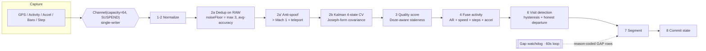

# Voyager — Engineering Case Study

*A private, on-device location timeline for Android — and a study in building something deliberate, deep, and
competitive, solo.*

---

## TL;DR

Voyager turns a noisy GPS stream into a **truthful, explainable** timeline that a person — or a tax auditor —
can trust, entirely **on the device**. It's three products sharing one encrypted record: **Memory** (where was I?),
**Proof** (prove my mileage/trip/presence), and **Habits** (my patterns). The hard part isn't the UI; it's making
inference **honest and explainable in real time** — which drove an 8-stage single-writer pipeline, an evidence-first
data model, and a "verify-then-flagship" development process.

| | |
|---|---|
| **Timeline** | Aug 2025 → Jul 2026 (~12 months), solo |
| **Commits** | 212, Conventional Commits throughout |
| **Code** | ~57,200 lines production Kotlin (413 files) |
| **Tests** | 660 across 107 files, incl. pipeline-invariant, concurrency, and a CI-enforced architecture-boundary test |
| **Data** | 30-table SQLCipher-encrypted Room schema |
| **Surface** | 28 screens · 26 ViewModels · 35 use-cases · 20 WorkManager jobs · 100% Jetpack Compose |

> Honest framing (because senior engineers value it): Voyager is **pre-production** (no real users yet, so
> battery/accuracy figures are rigorous estimates), a **heuristic engine, not ML** (deliberately — it wins on
> explainability, privacy, and bundling), and was built with **AI pair-programming** (the architecture,
> decisions, and product direction are mine — every line is defensible).

---

## 1. The problem & the wedge

Google discontinued Google Timeline's cloud sync and gave people no way to keep their history; most other
location apps monetize your movements. There was room for a **local-first** timeline that (a) you fully own and
(b) can *prove* things with. The go-to-market wedge is concrete: **import your Google Timeline JSON and bring your
history home** — *"Lost your Timeline? Bring it home."*

The insight that makes it more than a clone: the same on-device record can serve **three jobs** that are separate
apps today — memory (Google Timeline/Arc), proof (MileIQ, tax mileage), and habits (Strava, life analytics).
**One record, many jobs**, with no re-tracking and no per-feature data silo.

---

## 2. The defining engineering decision: visit-first → stream-first → hybrid

The first version was **visit-first**: detect stops, then infer the movement between them. It produced a laggy
live UI and made gaps and transport-mode changes hard to reason about. A retrospective concluded the foundation
wouldn't scale for the thing that mattered most — *explainability*.

So I rewrote the engine **stream-first**: process the raw sample stream continuously and infer state in real time.
But research (`STREAM_FIRST_VS_VISIT_FIRST_ARCHITECTURE_FINDINGS.md`) surfaced a subtle trap — a pure stream-first
model splits "stop truth" across layers and ends up **hiding duplicates at render time**, a smell that the
persistent model isn't canonical.

The shipped design is a **deliberate hybrid**, and being able to explain *why not pure either* is the point:
- **visit-first** for confirmed stops (durable, canonical `visits` rows),
- **segment-first** for movement and gaps (`movement_segments`),
- **runtime-state-first** for live, temporary UI (an in-memory snapshot, never persisted),
- **async geocoding** for names (coordinate placeholder → upgraded when the lookup returns).

*Changing my mind twice, on evidence, and landing on the nuanced answer — that's the story I'd tell an interviewer.*

---

## 3. The depth: an 8-stage, single-writer pipeline

Every accepted GPS sample flows through numbered stages on **one coroutine draining one channel** — no locks on
the hot path, correctness by **sequential construction**:

Why each choice matters, in one line each:
- **Single-writer channel (SUSPEND, cap 64):** removes read-modify-write races on the Kalman matrices, the dedup
  state, the segmenter buffer, and the dwell accumulator — and never drops data under load.
- **Dedup on *raw* coords before Kalman:** stationary jitter was producing *48+ samples/min*; an accuracy-aware
  noise floor kills it without smearing slow real movement.
- **Anti-spoof before Kalman:** a spoofed teleport can't corrupt the filter's reference point.
- **Joseph-form Kalman covariance:** keeps the covariance matrix positive-semi-definite across 10,000+ iterations
  so the filter can't diverge on multi-day tracking.
- **Honest gaps:** a 60-second watchdog writes **reason-coded GAP rows** (DORMANT vs GPS_LOSS vs PROCESS_DEAD…)
  instead of faking a smooth line. *Absence of data is a first-class, explainable row.*

And it **survives process death**: in-progress dwell is serialized to JSON; on restart the engine inserts a gap
for the dead window and resumes with `restartReason = CRASH_RESTORE`; the encrypted DB self-heals an unreadable
file rather than crash-loop.

---

## 4. The moat: evidence, honesty, one record

Voyager stores **why** alongside **what**. Every canonical object has an evidence sidecar table, and segments
carry **`counterEvidenceJson` — why competing labels were rejected.** Tap a "Walking" segment and it shows the
speed range, sample count, activity-recognition confidence, *and* why "Cycling" was ruled out. **No competitor
exposes counter-evidence.** That turns a black box into something a user — or an accountant, or a court — can
trust, and it's the one axis no incumbent can copy without abandoning their ad/data business model.

The four moat pillars: **local-first + encrypted by default** (SQLCipher always on, key device-bound in the
Android Keystore) · **evidence-backed UI** (incl. counter-evidence) · **honest gaps** · **one record, many jobs**.

---

## 5. The mindset: a "verify-then-flagship" process

The engine didn't get good by accident. A 106 KB living catalogue (`FEATURE_TEST_CATALOG.md`) drove the work in
**waves ordered by real-world impact** — "does tracking even run?" (Wave 0) before "polish" (Wave 10). Every
feature carried two gates: **verified** (behaves correctly on a real travel-test) and **improved** (raised to a
written *flagship bar*). *"A feature isn't done until both boxes are ticked."* Each card specifies **how to
travel-test it** and the bar it must clear.

Two habits an interviewer will notice:
- **Docs coupled to code** — feature commits land *with* their catalogue update, so the docs never drift.
- **Ruthless self-audit** — I literally graded my own codebase (it scored **F on testing** early), documented the
  flaws, *reopened previously-"DONE" tasks* when a branch stopped compiling, and then fixed the weakest axis (the
  new engine has 660 tests).

---

## 6. The rigor

- **660 tests** including `SyntheticPipelineTest` (drives the real segmenter over a synthetic day and asserts
  invariants), `PipelineGatewayBoundaryTest` (**fails CI if any pipeline file imports a Room DAO** — enforcing a
  Kotlin-Multiplatform-ready seam), `TimelineStateStoreConcurrencyTest` (proves concurrent updates don't lose
  writes), and `MileageCalculatorTest` (exact CO₂ constants, EV path, unit-invariance, integer-cent rounding).
- **CI on every PR** — per-flavor unit tests + both-flavor assembly + lint; a **monthly OWASP dependency scan**
  failing on CVSS ≥ 7.
- **Release-validated** — the minified R8/ProGuard build not only compiles but *runs* with data-heavy screens
  rendering correctly (the classic launch-day crash, pre-empted).

---

## 7. Competitive positioning (why it's not a toy)

| vs | Their edge | Voyager's answer |
|---|---|---|
| Google Timeline | free, accurate, default | *"They killed your cloud sync. We never had one."* Portability + proof + explainability |
| MileIQ | accountant-trusted mileage | Per-row **GPS evidence**, bundled — not a $60/yr single feature |
| Strava | fitness community | Private recording (Kalman + baro + accuracy-gating); no public heatmap by design |
| Life360 | real-time family + brand | (Handshake unbuilt — the honest gap) but *"we don't sell your family's location"* |
| Arc | best iOS UX | The Android answer with the same privacy ethos, on 70%+ of phones |

**4 of the 7 designed differentiators are shipped** (three-jobs-in-one, genuine on-device breadth, evidence/
explainability, court-grade mileage). The other three — family one-bit handshake, duress mode, OSM contribution
loop — are the roadmap.

---

## 8. Honest limitations (and what's next)

Framed as strengths, because knowing your gaps *is* seniority:
- **First-visit place accuracy** trails Google (no POI priors) → but every place is one-tap correctable and
  *explains itself*; next: POI priors + an OSM contribution loop.
- **Activity classification is speed-ambiguous** → mitigated with an accelerometer-variance signal, and every
  label is fused, explained, and correctable.
- **Heuristic, not ML** → deliberate: explainable, private, no training data.
- **Pre-production** → the next milestone is real-device dogfooding across OEMs for field battery data.
- **Dark-only, accessibility semantics on custom charts** → scoped next steps.

---

## 9. Stack

Kotlin · Jetpack Compose + Material 3 · Coroutines/Flow · Hilt · Room + **SQLCipher** · WorkManager · MapLibre GL
+ OpenStreetMap (no Google Maps API) · fused location / activity recognition / barometer / accelerometer /
significant-motion / Wi-Fi. Clean architecture, two product flavors (Play + F-Droid), CI + monthly security scan.

---

*Built by Anshul (Cosmic Laboratory). The app is 100% free. Source is private; this case study and the
[live site](https://okayanshul.github.io/voyager-site/) are the public window into how it was built.*
