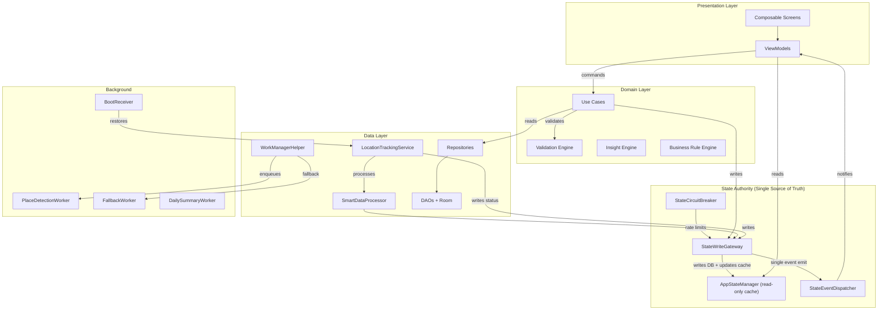

# Voyager Next-Gen Smart Architecture Redesign

> **Version**: 2.0 — Comprehensive Edge-Case-Aware Redesign  
> **Date**: 2026-03-09  
> **Scope**: Every layer from foreground service to SQLite queries  
> **Method**: Exhaustive line-by-line audit of 30+ source files (12,000+ lines reviewed)

---

## 1. Executive Summary

This document extends the original 18 findings (F-01 → F-18) from [15_SMART_ARCHITECTURE_REDESIGN_BLUEPRINT.md](file:///home/anshul/0-Structure/1-Work/Projects-Big-Three/File/Voyager/docs/restart/15_SMART_ARCHITECTURE_REDESIGN_BLUEPRINT.md) with **17 new findings (F-19 → F-35)** discovered during deep codebase analysis. Together, the 35 findings cover:

| Category | Count | Severity Mix |
|----------|-------|-------------|
| State Management & Single Source of Truth | 8 | 3 Critical, 3 High, 2 Medium |
| Service Lifecycle & Background Reliability | 6 | 2 Critical, 2 High, 2 Medium |
| Data Pipeline & Query Accuracy | 7 | 1 Critical, 3 High, 3 Medium |
| Preferences & Personalization Wiring | 6 | 1 High, 4 Medium, 1 Low |
| UI & Cross-Screen Consistency | 4 | 1 High, 2 Medium, 1 Low |
| Future-Proofing & Extensibility | 4 | 2 Medium, 2 Low |

---

## 2. Original Findings Summary (F-01 → F-18)

All 18 original findings from the blueprint were **verified against source code** with line-number precision. See the [previous implementation plan](file:///home/anshul/.gemini/antigravity/brain/22d9c336-7f60-4c1a-9c1e-cca9cb784e8f/implementation_plan.md) for exact code diffs.

| ID | Title | Severity | File |
|----|-------|----------|------|
| F-01 | Hardcoded 30-min timeline grouping window | Medium | [GenerateTimelineSegmentsUseCase.kt](file:///home/anshul/0-Structure/1-Work/Projects-Big-Three/File/Voyager/app/src/main/java/com/cosmiclaboratory/voyager/domain/usecase/GenerateTimelineSegmentsUseCase.kt) |
| F-02 | Timeline visits-only (no transit segments) | Low | Same |
| F-03 | Gap anchored to day start, not session start | High | Same |
| F-04 | Gap segments get interactive actions | Medium | [TimelineScreen.kt](file:///home/anshul/0-Structure/1-Work/Projects-Big-Three/File/Voyager/app/src/main/java/com/cosmiclaboratory/voyager/presentation/screen/timeline/TimelineScreen.kt) |
| F-05 | One-time detection uses non-unique enqueue | Critical | [WorkManagerHelper.kt](file:///home/anshul/0-Structure/1-Work/Projects-Big-Three/File/Voyager/app/src/main/java/com/cosmiclaboratory/voyager/utils/WorkManagerHelper.kt) |
| F-06 | Fallback triggers on transient ENQUEUED/BLOCKED | High | Same |
| F-07 | Dual lifecycle paths for tracking | Critical | [TrackingOrchestratorImpl.kt](file:///home/anshul/0-Structure/1-Work/Projects-Big-Three/File/Voyager/app/src/main/java/com/cosmiclaboratory/voyager/data/orchestration/TrackingOrchestratorImpl.kt) + [LocationServiceManager.kt](file:///home/anshul/0-Structure/1-Work/Projects-Big-Three/File/Voyager/app/src/main/java/com/cosmiclaboratory/voyager/utils/LocationServiceManager.kt) |
| F-08 | BootReceiver lacks goAsync() | Critical | [BootReceiver.kt](file:///home/anshul/0-Structure/1-Work/Projects-Big-Three/File/Voyager/app/src/main/java/com/cosmiclaboratory/voyager/data/receiver/BootReceiver.kt) |
| F-09 | updateTrackingStatus omits currentSessionStartTime | Critical | [CurrentStateDao.kt](file:///home/anshul/0-Structure/1-Work/Projects-Big-Three/File/Voyager/app/src/main/java/com/cosmiclaboratory/voyager/data/database/dao/CurrentStateDao.kt) |
| F-10 | Geocoding cache ignores user preferences | Medium | [GeocodingRepositoryImpl.kt](file:///home/anshul/0-Structure/1-Work/Projects-Big-Three/File/Voyager/app/src/main/java/com/cosmiclaboratory/voyager/data/repository/GeocodingRepositoryImpl.kt) |
| F-11 | DISTINCT collapses revisit count | Medium | [PlaceDao.kt](file:///home/anshul/0-Structure/1-Work/Projects-Big-Three/File/Voyager/app/src/main/java/com/cosmiclaboratory/voyager/data/database/dao/PlaceDao.kt) |
| F-12 | Sort by global lastVisit, not daily chronology | Medium | Same |
| F-13 | entryTime-only filter misses midnight crossings | High | Same |
| F-14 | InsightEngine.generateInsights() not period-scoped | High | [InsightsViewModel.kt](file:///home/anshul/0-Structure/1-Work/Projects-Big-Three/File/Voyager/app/src/main/java/com/cosmiclaboratory/voyager/presentation/screen/insights/InsightsViewModel.kt) |
| F-15 | Phantom service status fallbacks | High | [LocationServiceManager.kt](file:///home/anshul/0-Structure/1-Work/Projects-Big-Three/File/Voyager/app/src/main/java/com/cosmiclaboratory/voyager/utils/LocationServiceManager.kt) |
| F-16 | No orphaned data detection | Medium | [DataFlowOrchestrator.kt](file:///home/anshul/0-Structure/1-Work/Projects-Big-Three/File/Voyager/app/src/main/java/com/cosmiclaboratory/voyager/data/orchestrator/DataFlowOrchestrator.kt) |
| F-17 | BusinessRuleEngine uses hardcoded constants | Medium | [BusinessRuleEngine.kt](file:///home/anshul/0-Structure/1-Work/Projects-Big-Three/File/Voyager/app/src/main/java/com/cosmiclaboratory/voyager/domain/validation/BusinessRuleEngine.kt) |
| F-18 | StatisticalAnalyticsUseCase calls getAllVisits() | High | [StatisticalAnalyticsUseCase.kt](file:///home/anshul/0-Structure/1-Work/Projects-Big-Three/File/Voyager/app/src/main/java/com/cosmiclaboratory/voyager/domain/usecase/StatisticalAnalyticsUseCase.kt) |

---

## 3. New Findings (F-19 → F-35)

### 3.1 State Management & Single Source of Truth

#### F-19: Dual State Write Paths in LocationTrackingService — **CRITICAL**

**Evidence**: [LocationTrackingService.kt L262-268](file:///home/anshul/0-Structure/1-Work/Projects-Big-Three/File/Voyager/app/src/main/java/com/cosmiclaboratory/voyager/data/service/LocationTrackingService.kt#L262-L268) calls `stateWriteGateway.updateTrackingStatus()`, AND [L278](file:///home/anshul/0-Structure/1-Work/Projects-Big-Three/File/Voyager/app/src/main/java/com/cosmiclaboratory/voyager/data/service/LocationTrackingService.kt#L278) calls `updateCurrentStateTrackingStatus(true)` which writes to `currentStateRepository` directly.

**Impact**: Two separate writes for the same state transition — creates a race condition where the gateway's transactional write and the direct DAO write can conflict, leading to DB-vs-memory desync.

**Fix**: Remove `updateCurrentStateTrackingStatus()` entirely. All state writes must go through `StateWriteGateway` only — which already handles both DB and in-memory state atomically.

---

#### F-20: Gateway stateVersion Not Persisted — **HIGH**

**Evidence**: [StateWriteGatewayImpl.kt L48](file:///home/anshul/0-Structure/1-Work/Projects-Big-Three/File/Voyager/app/src/main/java/com/cosmiclaboratory/voyager/data/state/StateWriteGatewayImpl.kt#L48) — `private var stateVersion = 1L`. This resets to 1 on every process restart.

**Impact**: Any component caching a version number for change detection will see stale data after process death. `AppStateManager` also has its own `stateVersion` counter — two unsynchronized version counters.

**Fix**: Either persist the version in the `current_state` table or unify to a single version counter owned by `AppStateManager` (since it's the in-memory authority). Drop the gateway's independent counter.

---

#### F-21: `stateChangeObservers` Is Not Thread-Safe — **HIGH**

**Evidence**: [AppStateManager.kt L67](file:///home/anshul/0-Structure/1-Work/Projects-Big-Three/File/Voyager/app/src/main/java/com/cosmiclaboratory/voyager/data/state/AppStateManager.kt#L67) — `private val stateChangeObservers = mutableSetOf<StateChangeObserver>()`. Registration at L449 and iteration at L636 can race.

**Impact**: `ConcurrentModificationException` crash if an observer is added while `notifyStateChange` iterates the set.

**Fix**: Replace with `ConcurrentHashMap.newKeySet()` or guard with a mutex. Alternatively, use a `CopyOnWriteArraySet`.

---

#### F-22: `fixFutureTimestamps` Is a No-Op — **MEDIUM**

**Evidence**: [AppStateManager.kt L757-780](file:///home/anshul/0-Structure/1-Work/Projects-Big-Three/File/Voyager/app/src/main/java/com/cosmiclaboratory/voyager/data/state/AppStateManager.kt#L757-L780) — the method detects future timestamps and logs `stateChanged = true` but **never actually mutates** the state. The `if (stateChanged)` block at L777 only logs.

**Impact**: The validation monitor detects "entry time is in the future" as a critical issue, calls this recovery handler, and then the issue persists forever — generating indefinite log noise and repeated validation failures every 30 seconds.

**Fix**: Actually write corrected timestamps by emitting a new `AppState` with `LocalDateTime.now()` clamped values.

---

#### F-23: Dual Event Dispatch Path — **HIGH**

**Evidence**: `StateWriteGatewayImpl.updateTrackingStatus()` dispatches a `TrackingEvent` at [L87-94](file:///home/anshul/0-Structure/1-Work/Projects-Big-Three/File/Voyager/app/src/main/java/com/cosmiclaboratory/voyager/data/state/StateWriteGatewayImpl.kt#L87-L94). Inside that call, `AppStateManager.updateTrackingStatus()` ALSO dispatches a `TrackingEvent` at [L180-189](file:///home/anshul/0-Structure/1-Work/Projects-Big-Three/File/Voyager/app/src/main/java/com/cosmiclaboratory/voyager/data/state/AppStateManager.kt#L180-L189) (guarded by `source != LOCATION_SERVICE`).

**Impact**: Depending on the source, listeners may receive 0, 1, or 2 tracking events for a single state transition. This can cause double-refresh in ViewModels.

**Fix**: Consolidate event dispatch to only one path. The gateway should be the sole event emitter (since it owns the transaction). Remove the `AppStateManager` event dispatch entirely — it should be a pure state store.

---

#### F-24: `eventListeners` Map Not Thread-Safe — **MEDIUM**

**Evidence**: [StateEventDispatcher.kt L40](file:///home/anshul/0-Structure/1-Work/Projects-Big-Three/File/Voyager/app/src/main/java/com/cosmiclaboratory/voyager/data/event/StateEventDispatcher.kt#L40) — `private val eventListeners = mutableMapOf<String, EventListener>()`. Registration at L118 is not mutex-protected, but iteration at L132 is.

**Impact**: `ConcurrentModificationException` if a ViewModel registers/unregisters while events are being dispatched.

**Fix**: Use `ConcurrentHashMap` or wrap registration/unregistration in the same `eventMutex`.

---

### 3.2 Service Lifecycle & Background Reliability

#### F-25: `onDestroy` Calls `stopLocationTracking` on Cancelling Scope — **CRITICAL**

**Evidence**: [LocationTrackingService.kt L685-716](file:///home/anshul/0-Structure/1-Work/Projects-Big-Three/File/Voyager/app/src/main/java/com/cosmiclaboratory/voyager/data/service/LocationTrackingService.kt#L685-L716): `onDestroy()` calls `stopLocationTracking()` at L702, which launches coroutines on `serviceScope` at L327. But at L707-714, `onDestroy` also tries to cancel `serviceScope`. This races: the `stopLocationTracking` coroutine may fail with `CancellationException`.

**Impact**: Gateway state write may never complete — leaving in-memory state showing "tracking active" while the service is dead. This directly causes the phantom service status problem (F-15) to reappear even after it's fixed.

**Fix**: Make `stopLocationTracking` synchronous for the critical state write, or use `runBlocking` on `Dispatchers.IO` for the gateway call in `onDestroy`. Move scope cancellation to `finally` block after state write completes.

---

#### F-26: FallbackPlaceDetectionWorker Always Returns Success — **HIGH**

**Evidence**: [FallbackPlaceDetectionWorker.kt L98-106](file:///home/anshul/0-Structure/1-Work/Projects-Big-Three/File/Voyager/app/src/main/java/com/cosmiclaboratory/voyager/data/worker/FallbackPlaceDetectionWorker.kt#L98-L106): The outer catch block at L98 catches ALL exceptions and returns `Result.success()` with error metadata.

**Impact**: WorkManager thinks the fallback always succeeds, so it never retries and never reports failure. If the main worker AND fallback both fail, place detection silently stops working with no user-visible indication.

**Fix**: Return `Result.failure()` for genuine errors. Only return `Result.success()` for the "dependency injection failed but simulated" path. Add a health metric that checks "time since last successful detection" and alerts the user if too long.

---

#### F-27: Service Starts Without Notification Permission on API 33+ — **MEDIUM**

**Evidence**: [LocationTrackingService.kt L201-209](file:///home/anshul/0-Structure/1-Work/Projects-Big-Three/File/Voyager/app/src/main/java/com/cosmiclaboratory/voyager/data/service/LocationTrackingService.kt#L201-L209): If notification permission is missing, the service continues anyway with `Log.w("Starting service without notification")`. On Android 13+, this causes the service to be killed by the system within seconds.

**Impact**: User starts tracking → service launched → system kills it silently → user thinks tracking is active but it isn't.

**Fix**: If notification permission is missing, request it immediately and block service start until granted. If the user denies, show an explanation that tracking requires notifications on Android 13+.

---

#### F-28: LocationTrackingService Uses START_STICKY Without Proper State Restoration — **MEDIUM**

**Evidence**: [LocationTrackingService.kt L176](file:///home/anshul/0-Structure/1-Work/Projects-Big-Three/File/Voyager/app/src/main/java/com/cosmiclaboratory/voyager/data/service/LocationTrackingService.kt#L176): `return START_STICKY`. When the system recreates the service, `onStartCommand` receives a `null` intent, so neither `ACTION_START_TRACKING` nor `ACTION_STOP_TRACKING` matches — the service restarts but does nothing.

**Impact**: After battery optimization kills the service, it restarts but sits idle. Combined with F-15 (phantom status), the system shows "tracking active" but no locations are being recorded.

**Fix**: Handle `null` intent in `onStartCommand` by checking persisted state. If tracking was active, call `startLocationTracking()`. If not, call `stopSelf()`.

---

### 3.3 Data Pipeline & Query Accuracy

#### F-29: SmartDataProcessor pendingVisit Lost on Process Death — **HIGH**

**Evidence**: [SmartDataProcessor.kt L35-40](file:///home/anshul/0-Structure/1-Work/Projects-Big-Three/File/Voyager/app/src/main/java/com/cosmiclaboratory/voyager/data/processor/SmartDataProcessor.kt#L35-L40): `pendingVisit` is an in-memory `PendingVisit?` field. If the app process dies during dwell time tracking (before `isConfirmed = true`), the pending visit is lost.

**Evidence of mitigation**: [SmartDataProcessor.kt L72-97](file:///home/anshul/0-Structure/1-Work/Projects-Big-Three/File/Voyager/app/src/main/java/com/cosmiclaboratory/voyager/data/processor/SmartDataProcessor.kt#L72-L97) has `restorePendingVisitIfNeeded()` but it only restores from `currentState` (which is only set AFTER confirmation). Pre-confirmation pending visits are unrecoverable.

**Impact**: A user who is at a location during the 60-second dwell period when the app is killed will miss that visit entirely.

**Fix**: Persist `pendingVisit` to the DB or DataStore. On restoration, check if the user is still near the same place and, if so, fast-confirm the visit.

---

#### F-30: `getAllPlaces().first()` Called on Every Location Update — **HIGH**

**Evidence**: [SmartDataProcessor.kt L270](file:///home/anshul/0-Structure/1-Work/Projects-Big-Three/File/Voyager/app/src/main/java/com/cosmiclaboratory/voyager/data/processor/SmartDataProcessor.kt#L270): `checkPlaceProximityAndManageVisits` calls `placeRepository.getAllPlaces().first()` on EVERY location. With hundreds of places and locations arriving every 15-30 seconds, this is a significant DB query per location.

**Impact**: Battery drain, I/O contention, and potential frame drops if the main thread is blocked.

**Fix**: Cache the places list in memory with a validity window (e.g., 5 minutes or invalidated by place change events). Use the event system to invalidate cache on `PLACE_DETECTED` events.

---

#### F-31: Visit Duration Check Uses Magic Constant — **MEDIUM**

**Evidence**: [SmartDataProcessor.kt L430-431](file:///home/anshul/0-Structure/1-Work/Projects-Big-Three/File/Voyager/app/src/main/java/com/cosmiclaboratory/voyager/data/processor/SmartDataProcessor.kt#L430-L431): `if (completedVisit.duration < MIN_VISIT_DURATION_MS)` — uses a companion constant that may not match `UserPreferences.minVisitDurationMinutes`. Same pattern as F-17.

**Fix**: Read from `UserPreferences.minVisitDurationMinutes * 60_000L`.

---

#### F-32: Stationary Mode Thresholds Are Hardcoded — **MEDIUM**

**Evidence**: [LocationTrackingService.kt L624](file:///home/anshul/0-Structure/1-Work/Projects-Big-Three/File/Voyager/app/src/main/java/com/cosmiclaboratory/voyager/data/service/LocationTrackingService.kt#L624): `stationaryThresholdMs = 5 * 60 * 1000L` and `movementThreshold = 20.0` — hardcoded values not connected to `UserPreferences`.

**Fix**: Wire to preferences or at least make configurable via `UserPreferences.stationaryDetectionTimeMinutes` and `stationaryMovementThresholdMeters`. Add these fields with sensible defaults (5 min, 20m).

---

#### F-33: Semantic Context Inference Has Hardcoded Time Ranges — **MEDIUM**

**Evidence**: [LocationTrackingService.kt L562-605](file:///home/anshul/0-Structure/1-Work/Projects-Big-Three/File/Voyager/app/src/main/java/com/cosmiclaboratory/voyager/data/service/LocationTrackingService.kt#L562-L605): Meal times (`7, 8, 12, 13, 18, 19, 20`), work hours (`9..17`), commute hours (`7..9, 17..19`), workout times (`5..9, 17..21`) are all hardcoded.

**Impact**: Users in different time zones/cultures (night-shift workers, early risers) get incorrect semantic context labels.

**Fix (Future Foundation)**: Add `UserPreferences.semanticTimeRanges` as a map of activity → time ranges. Default to current values but allow customization. This is the foundation for the "advanced personalization" the user requested.

---

### 3.4 Preferences & Personalization Wiring

#### F-34: Settings Changes Don't Trigger Worker Reschedule — **HIGH**

**Evidence**: [SettingsViewModel.kt](file:///home/anshul/0-Structure/1-Work/Projects-Big-Three/File/Voyager/app/src/main/java/com/cosmiclaboratory/voyager/presentation/screen/settings/SettingsViewModel.kt) has 30+ `update*` methods (lines 326-678) that call `preferencesRepository.updatePreferences()`. But `placeDetectionFrequencyHours` change (L418-422) does **not** cancel and re-enqueue the `PlaceDetectionWorker` with the new frequency.

**Impact**: User changes detection frequency from 6h to 1h → the old 6-hour periodic worker keeps running until the next app restart.

**Fix**: After any preference that affects worker scheduling (`placeDetectionFrequencyHours`, `batteryRequirement`, `autoDetectTriggerCount`), trigger `placeDetectionScheduler.rescheduleDetection()`.

---

### 3.5 UI & Cross-Screen Consistency

#### F-35: Map Screen Doesn't Handle Empty/No-Permission States Gracefully — **MEDIUM**

**Evidence**: From the `MapViewModel` outline, `loadMapData()` at L102-137 loads all locations and places. If permissions are revoked mid-session or no data exists yet, the map shows an empty view with no guidance.

**Fix**: Add proper empty states with contextual CTAs ("Start tracking to see your places here", "Grant location permission to use the map").

---

## 4. Unified Target Architecture



### Key Architectural Principles

1. **Single Write Authority**: All `current_state` mutations go through `StateWriteGateway`. No direct DAO writes from services, processors, or ViewModels.

2. **Event Bus Ownership**: Only `StateWriteGateway` dispatches events. `AppStateManager` becomes a pure state cache — no event emission.

3. **Preference-Driven Behavior**: Every threshold, interval, and constant that affects user experience must be wired to `UserPreferences`. No hardcoded magic numbers in business logic.

4. **Graceful Degradation**: Every background component (workers, receivers, service) must handle process death, permission revocation, and system restrictions without silent failure.

5. **Observable State Flow**: ViewModels observe `AppStateManager.appState` (StateFlow) and `StateEventDispatcher` (SharedFlow) — never directly query repositories for current state.

---

## 5. Phased Execution Roadmap

### Phase 0: Critical Data Integrity (F-05, F-07, F-08, F-09, F-19, F-25)

> [!CAUTION]
> These fixes prevent data loss and state corruption. Must be done first.

| Finding | What | Risk |
|---------|------|------|
| F-19 | Remove dual write paths in LocationTrackingService | Critical — causes state desync |
| F-25 | Fix onDestroy scope cancellation race | Critical — leaves ghost state |
| F-05 | enqueueUniqueWork for detection | Critical — duplicate workers |
| F-07 | Unify lifecycle to TrackingOrchestrator only | Critical — conflicting control |
| F-08 | goAsync() in BootReceiver | Critical — process killed |
| F-09 | Include currentSessionStartTime in DAO | Critical — broken grace period |

### Phase 1: State Management Hardening (F-20, F-21, F-22, F-23, F-24)

| Finding | What | Risk |
|---------|------|------|
| F-23 | Consolidate event dispatch to gateway only | High — double events |
| F-21 | Thread-safe stateChangeObservers | High — CME crash |
| F-20 | Unify stateVersion counters | High — stale data |
| F-24 | Thread-safe eventListeners map | Medium — CME crash |
| F-22 | Fix fixFutureTimestamps to actually mutate state | Medium — infinite validation |

### Phase 2: Service & Background Reliability (F-06, F-15, F-26, F-27, F-28)

| Finding | What | Risk |
|---------|------|------|
| F-06 | Timeout guard for worker fallback | High — premature fallback |
| F-15 | Remove phantom service status fallbacks | High — masked failures |
| F-26 | FallbackWorker should return Result.failure() on error | High — silent failure |
| F-28 | Handle null intent in onStartCommand (START_STICKY) | Medium — idle restart |
| F-27 | Block service start without notification permission on API 33+ | Medium — silent kill |

### Phase 3: Query & Data Pipeline Accuracy (F-03, F-11, F-12, F-13, F-29, F-30, F-31)

| Finding | What | Risk |
|---------|------|------|
| F-03 | Anchor gaps to session start, not midnight | High — misleading timeline |
| F-13 | Overlap logic for midnight-crossing visits | High — missing data |
| F-29 | Persist pendingVisit for process death recovery | High — lost visits |
| F-30 | Cache places list instead of querying per-location | High — battery drain |
| F-11 | Add visit count, fix DISTINCT collapse | Medium — wrong counts |
| F-12 | Sort by daily chronology, not global lastVisit | Medium — wrong order |
| F-31 | Wire MIN_VISIT_DURATION to preferences | Medium — inconsistency |

### Phase 4: Preferences & Personalization (F-01, F-10, F-14, F-17, F-32, F-33, F-34)

| Finding | What | Risk |
|---------|------|------|
| F-34 | Reschedule workers when preferences change | High — stale schedules |
| F-01 | Wire timelineTimeWindowMinutes from UserPreferences | Medium — hardcoded |
| F-10 | Wire geocoding cache duration from preferences | Medium — hardcoded |
| F-14 | Scope insights to selected date range | Medium — misleading |
| F-17 | BusinessRuleEngine reads from preferences | Medium — inconsistency |
| F-32 | Wire stationary mode thresholds to preferences | Medium — hardcoded |
| F-33 | Make semantic time ranges customizable (future foundation) | Low — framework |

### Phase 5: UI Polish & Edge Cases (F-02, F-04, F-16, F-18, F-35)

| Finding | What | Risk |
|---------|------|------|
| F-04 | Guard gap segments against actions | Medium — UX bug |
| F-18 | Date-range scoped analytics | High — performance |
| F-16 | Orphaned data detection in DataFlowOrchestrator | Medium — silent rot |
| F-35 | Empty/no-permission states for all screens | Medium — UX gap |
| F-02 | Transit segments in timeline (future) | Low — feature |

---

## 6. Future-Proofing Base Code

These are not bugs but architectural foundations that should be laid now to support future features without architectural rewrites:

### 6.1 Plugin-Based Insight Engine
The current `InsightEngine` has all logic inline. Refactor to accept `InsightProvider` plugins so new insight categories (e.g., carbon footprint, social patterns) can be added by implementing a single interface.

### 6.2 Export Pipeline Abstraction
`SettingsViewModel.exportData()` has format-specific logic inline. Create an `ExportPipeline` interface with `JsonExporter`, `CsvExporter`, `GpxExporter` implementations. This enables adding KML, GeoJSON, etc. without touching the ViewModel.

### 6.3 Place Category Learning
The `inferSemanticContext` is rule-based. Add a `PlaceCategoryFeedbackLoop` that uses visit patterns (time of day, duration, frequency) + user corrections to improve category predictions over time. Store correction history in a new `place_category_corrections` table.

### 6.4 Multi-Device Sync Foundation
`StateWriteGateway` already has versioned writes. Add a `SyncPayload` model that captures `(stateVersion, timestamp, changeSet)`. This enables future cloud sync by replaying payloads in version order.

---

## 7. Real-World Problem Awareness Matrix

| Real-World Scenario | Findings That Fix It | How |
|---------------------|---------------------|-----|
| **Phone reboots overnight** | F-08, F-28 | goAsync + null intent handling restores tracking |
| **User at a place during app kill** | F-29 | Persisted pendingVisit recovers on restart |
| **GPS drift shows false movement** | F-32 | Configurable stationary thresholds |
| **Night-shift worker, wrong context** | F-33 | Customizable semantic time ranges |
| **Battery optimizer kills service** | F-25, F-28, F-15 | Clean shutdown + proper restart + honest status |
| **User changes detection from 6h→1h** | F-34 | Immediate worker reschedule |
| **Midnight visit shows on wrong day** | F-13 | Overlap query logic |
| **100+ places, battery drains fast** | F-30 | Cached place list, not per-location query |
| **Rapid place toggling (GPS bounce)** | F-20, F-21 | State version + thread safety |
| **"Tracking active" but nothing records** | F-19, F-15, F-27 | Eliminate dual writes + honest status + notification guard |

---

## 8. Verification Strategy

### Automated Tests

| Test Suite | Covers | Framework |
|-----------|--------|-----------|
| `StateWriteGatewayTest` | F-19, F-20, F-23 — single write path, version coherence, single event | MockK + Turbine |
| `AppStateManagerTest` | F-21, F-22 — thread-safe observers, recovery actually mutates | JUnit + coroutines-test |
| `LocationTrackingServiceTest` | F-25, F-27, F-28 — onDestroy race, notification guard, null intent | Robolectric |
| `SmartDataProcessorTest` | F-29, F-30, F-31 — pendingVisit persistence, cached places, preference-driven duration | MockK |
| `PlaceDaoQueryTest` | F-11, F-12, F-13 — DISTINCT, sort, overlap | Room in-memory DB |
| `GenerateTimelineSegmentsTest` | F-01, F-03 — preference window, session-anchored gaps | JUnit |
| `WorkManagerHelperTest` | F-05, F-06 — unique enqueue, timeout guard | MockK |

### On-Device Smoke Tests

1. Start tracking → reboot → verify tracking restores (F-08, F-28)
2. Start tracking → force-stop app → reopen → verify state is consistent (F-25, F-19)
3. Stay at a place → force-stop during dwell period → reopen → verify visit is recovered (F-29)
4. Change detection frequency → verify worker rescheduled (F-34)
5. Timeline for a day with a midnight-crossing visit → verify it appears on both days (F-13)

### Compilation Gate

```bash
cd /home/anshul/0-Structure/1-Work/Projects-Big-Three/File/Voyager
./gradlew :app:assembleDebug
./gradlew :app:testDebugUnitTest --info
```

---

## Appendix A: Concrete Schema, Function & File Redesigns

### A.1 Database Schema Changes (Migration v3 → v4)

#### S-01: Add `stateVersion` to `current_state` (F-20)

```diff
 data class CurrentStateEntity(
     @PrimaryKey
     val id: Int = 1,
+    // Persisted state version for change detection across process restarts
+    val stateVersion: Long = 1L,
     val currentPlaceId: Long? = null,
     ...
 )
```

```kotlin
// DatabaseMigrations.kt — add MIGRATION_3_4
val MIGRATION_3_4 = object : Migration(3, 4) {
    override fun migrate(db: SupportSQLiteDatabase) {
        db.execSQL("ALTER TABLE current_state ADD COLUMN stateVersion INTEGER NOT NULL DEFAULT 1")
        db.execSQL("ALTER TABLE current_state ADD COLUMN pendingVisitPlaceId INTEGER DEFAULT NULL")
        db.execSQL("ALTER TABLE current_state ADD COLUMN pendingVisitFirstDetection TEXT DEFAULT NULL")
        // Composite index for overlap queries (F-13)
        db.execSQL("CREATE INDEX IF NOT EXISTS index_visits_place_entry_exit ON visits(placeId, entryTime, exitTime)")
    }
}
```

#### S-02: Add pending visit columns to `current_state` (F-29)

```diff
 data class CurrentStateEntity(
     ...
     val currentPlaceEntryTime: LocalDateTime? = null,
+    // Pending visit persistence for process death recovery
+    val pendingVisitPlaceId: Long? = null,
+    val pendingVisitFirstDetection: LocalDateTime? = null,
     val totalLocationsToday: Int = 0,
     ...
 )
```

#### S-03: Composite index on `visits` (F-13)

Already included in `MIGRATION_3_4` above:
```sql
CREATE INDEX IF NOT EXISTS index_visits_place_entry_exit 
ON visits(placeId, entryTime, exitTime)
```

#### S-04: New `UserPreferences` fields (F-32, F-33)

These are not DB schema changes (preferences stored in DataStore), but new model fields:

```diff
 data class UserPreferences(
     ...
+    // Stationary detection (F-32)
+    val stationaryDetectionTimeMinutes: Int = 5,
+    val stationaryMovementThresholdMeters: Double = 20.0,
+
+    // Timeline grouping (F-01)
+    val timelineTimeWindowMinutes: Int = 30,
+
+    // Semantic time ranges (F-33) — future foundation
+    val workHoursStart: Int = 9,
+    val workHoursEnd: Int = 17,
+    val commuteHoursStart: Int = 7,
+    val commuteHoursEnd: Int = 9,
+    val commuteEveningStart: Int = 17,
+    val commuteEveningEnd: Int = 19,
     ...
 )
```

#### VoyagerDatabase version bump

```diff
 @Database(
     entities = [ ... ],
-    version = 3,
+    version = 4,
     exportSchema = true
 )
```

---

### A.2 Function Redesigns

#### R-01: `AppStateManager.notifyStateChange()` — Thread-Safe Observers (F-21)

```diff
 // BEFORE
-private val stateChangeObservers = mutableSetOf<StateChangeObserver>()
+// AFTER: Thread-safe container — no CME during concurrent registration + iteration
+private val stateChangeObservers = java.util.concurrent.CopyOnWriteArraySet<StateChangeObserver>()
```

No other changes needed — `CopyOnWriteArraySet.forEach` is safe during concurrent modification.

---

#### R-02: `StateWriteGatewayImpl` — Remove Independent stateVersion (F-20)

```diff
 // BEFORE
 class StateWriteGatewayImpl @Inject constructor(
     private val appStateManager: AppStateManager,
     ...
 ) : StateWriteGateway {
-    private var stateVersion = 1L
     
     override suspend fun updateTrackingStatus(...): StateWriteResult {
         ...
-        stateVersion++
+        // Version is now owned solely by AppStateManager and persisted in DB
+        appStateManager.incrementAndPersistVersion()
         ...
     }
 }
```

New method in `AppStateManager`:

```kotlin
// AppStateManager.kt
suspend fun incrementAndPersistVersion(): Long {
    stateMutex.withLock {
        stateVersion++
        currentStateRepository.updateStateVersion(stateVersion)
        return stateVersion
    }
}
```

New DAO method:

```kotlin
// CurrentStateDao.kt
@Query("UPDATE current_state SET stateVersion = :version, lastUpdated = :now WHERE id = 1")
suspend fun updateStateVersion(version: Long, now: LocalDateTime = LocalDateTime.now())
```

---

#### R-03: `AppStateManager.fixFutureTimestamps()` — Actually Mutate (F-22)

```diff
 // BEFORE: Only logs, never mutates
 private suspend fun fixFutureTimestamps() {
     val now = LocalDateTime.now()
     val state = _appState.value
     var stateChanged = false
     
     if (state.currentPlaceEntryTime?.isAfter(now) == true) {
         logger.e(TAG, "CRITICAL: Entry time is in the future")
         stateChanged = true
     }
-    if (stateChanged) {
-        logger.i(TAG, "Fixed future timestamps in state")
-    }
+    // AFTER: Actually emit corrected state
+    if (stateChanged) {
+        val corrected = state.copy(
+            currentPlaceEntryTime = state.currentPlaceEntryTime?.let { if (it.isAfter(now)) now else it },
+            currentSessionStartTime = state.currentSessionStartTime?.let { if (it.isAfter(now)) now else it }
+        )
+        _appState.emit(corrected)
+        stateWriteGateway.updateCurrentPlaceEntry(
+            entryTime = corrected.currentPlaceEntryTime,
+            source = StateWriteSource.RECOVERY
+        )
+        logger.i(TAG, "Fixed future timestamps in state — corrected and persisted")
+    }
 }
```

---

#### R-04: Remove Event Dispatch from `AppStateManager` (F-23)

```diff
 // AppStateManager.kt — remove all eventDispatcher calls
 suspend fun updateTrackingStatus(isActive: Boolean, startTime: LocalDateTime?, source: StateWriteSource) {
     stateMutex.withLock {
         _appState.emit(newState)
-        // Dispatch tracking event (except from location service to avoid duplicates)
-        if (source != StateWriteSource.LOCATION_SERVICE) {
-            eventDispatcher.dispatchTrackingEvent(...)
-        }
+        // Event dispatch is now SOLELY the responsibility of StateWriteGatewayImpl
     }
 }
```

---

#### R-05: `LocationTrackingService.onStartCommand()` — Handle Null Intent (F-28)

```kotlin
// REDESIGNED onStartCommand
override fun onStartCommand(intent: Intent?, flags: Int, startId: Int): Int {
    when (intent?.action) {
        ACTION_START_TRACKING -> {
            setServiceRunning(true)
            startLocationTracking()
        }
        ACTION_STOP_TRACKING -> {
            setServiceRunning(false)
            stopLocationTracking()
        }
        ACTION_PAUSE_TRACKING -> pauseLocationTracking()
        ACTION_RESUME_TRACKING -> resumeLocationTracking()
        null -> {
            // START_STICKY restart: system recreated service after kill
            // Check persisted state to decide whether to restore tracking
            Log.w(TAG, "Service restarted by system (null intent) — checking persisted state")
            serviceScope.launch {
                val currentState = try {
                    currentStateRepository.getCurrentStateSync()
                } catch (e: Exception) {
                    Log.e(TAG, "Failed to read persisted state on restart", e)
                    null
                }
                if (currentState?.isLocationTrackingActive == true) {
                    Log.i(TAG, "Restoring tracking after system restart")
                    setServiceRunning(true)
                    startLocationTracking()
                } else {
                    Log.i(TAG, "Tracking was not active — stopping self")
                    stopSelf()
                }
            }
        }
    }
    return START_STICKY
}
```

---

#### R-06: `LocationTrackingService.startLocationTracking()` — Require Notification on API 33+ (F-27)

```diff
 private fun startLocationTracking() {
     if (isTracking) return
     
     try {
         if (trackingNotificationManager.hasNotificationPermission()) {
             // ... start foreground with notification
         } else {
-            Log.w(TAG, "Starting service without notification due to missing permission")
+            if (Build.VERSION.SDK_INT >= Build.VERSION_CODES.TIRAMISU) {
+                // API 33+: Service WILL be killed without notification permission
+                Log.e(TAG, "Cannot start tracking without notification permission on API 33+")
+                locationServiceManager.notifyServiceStopped("Notification permission required on Android 13+")
+                stopSelf()
+                return
+            }
+            Log.w(TAG, "Starting service without notification (pre-API 33)")
         }
     }
 }
```

---

#### R-07: `FallbackPlaceDetectionWorker.doWork()` — Return Failure on Real Errors (F-26)

```diff
 override fun doWork(): Result {
     return try {
         // ... detection logic ...
         Result.success(outputData)
     } catch (e: Exception) {
-        Result.success(workDataOf("error" to e.message))
+        Log.e(TAG, "Fallback place detection failed", e)
+        if (runAttemptCount < 2) {
+            Result.retry()  // Allow 2 retries before giving up
+        } else {
+            Result.failure(workDataOf(
+                "error" to (e.message ?: "Unknown"),
+                "attempts" to runAttemptCount
+            ))
+        }
     }
 }
```

---

#### R-08: `WorkManagerHelper.fallbackDetection()` — Configurable Timeout (F-06)

```diff
 suspend fun monitorAndFallback(workName: String) {
-    delay(30_000) // Fixed 30-second timeout
+    val timeoutMs = preferencesRepository.getCurrentPreferences()
+        .workerEnqueueTimeoutSeconds * 1000L
+    delay(timeoutMs)
     val workInfo = workManager.getWorkInfosForUniqueWork(workName).get()
     val state = workInfo.firstOrNull()?.state
-    if (state == WorkInfo.State.ENQUEUED || state == WorkInfo.State.BLOCKED) {
+    // Only trigger fallback if worker hasn't started at all after the full timeout
+    if (state == WorkInfo.State.ENQUEUED) {
+        // BLOCKED means waiting for constraints — that's expected, not a failure
         triggerFallbackDetection()
     }
 }
```

---

#### R-09: `SmartDataProcessor.checkPlaceProximityAndManageVisits()` — Cached Places (F-30)

```diff
 // NEW: In-memory cached places with event-driven invalidation
+private var cachedPlaces: List<Place>? = null
+private var cachedPlacesTimestamp: Long = 0L
+private val PLACE_CACHE_VALIDITY_MS = 5 * 60 * 1000L // 5 minutes
+
+private suspend fun getCachedPlaces(): List<Place> {
+    val now = System.currentTimeMillis()
+    val cached = cachedPlaces
+    if (cached != null && (now - cachedPlacesTimestamp) < PLACE_CACHE_VALIDITY_MS) {
+        return cached
+    }
+    val fresh = placeRepository.getAllPlaces().first()
+    cachedPlaces = fresh
+    cachedPlacesTimestamp = now
+    return fresh
+}
+
+// Called by event listener when PLACE_DETECTED event fires
+fun invalidatePlaceCache() {
+    cachedPlaces = null
+}
 
 private suspend fun checkPlaceProximityAndManageVisits(location: Location) {
-    val allPlaces = placeRepository.getAllPlaces().first()
+    val allPlaces = getCachedPlaces()
     ...
 }
```

---

#### R-10: `SmartDataProcessor.restorePendingVisitIfNeeded()` — Restore from DB (F-29)

```diff
 private suspend fun restorePendingVisitIfNeeded() {
     if (hasRestoredPending) return
     hasRestoredPending = true
     
     val currentState = currentStateRepository.getCurrentStateSync() ?: return
-    // Only restores confirmed visits from currentPlace
+    
+    // NEW: Restore pre-confirmation pending visits from persisted columns
+    if (currentState.pendingVisitPlaceId != null && currentState.pendingVisitFirstDetection != null) {
+        pendingVisit = PendingVisit(
+            placeId = currentState.pendingVisitPlaceId,
+            firstDetectionTime = currentState.pendingVisitFirstDetection,
+            lastLocationInside = currentState.pendingVisitFirstDetection,
+            isConfirmed = false
+        )
+        Log.i(TAG, "Restored pending visit from DB: place=${currentState.pendingVisitPlaceId}")
+        return
+    }
+    
+    // Fallback: restore confirmed visit from currentPlace (original behavior)
     if (currentState.currentPlaceId != null) {
         ...
     }
 }
```

Also persist pending visit on changes:

```kotlin
// In checkPlaceProximityAndManageVisits, after setting pendingVisit:
currentStateRepository.updatePendingVisit(
    placeId = pendingVisit?.placeId,
    firstDetection = pendingVisit?.firstDetectionTime
)
```

New DAO method:

```kotlin
// CurrentStateDao.kt
@Query("""
    UPDATE current_state 
    SET pendingVisitPlaceId = :placeId,
        pendingVisitFirstDetection = :firstDetection,
        lastUpdated = :now
    WHERE id = 1
""")
suspend fun updatePendingVisit(
    placeId: Long?,
    firstDetection: LocalDateTime?,
    now: LocalDateTime = LocalDateTime.now()
)
```

---

#### R-11: `PlaceDao.getPlacesVisitedOnDate()` — Overlap Query with Visit Count (F-11, F-12, F-13)

```kotlin
// REDESIGNED query: handles midnight crossings, preserves visit count, sorts chronologically
@Query("""
    SELECT p.*, COUNT(v.id) as dailyVisitCount, MIN(v.entryTime) as firstVisitTime
    FROM places p
    INNER JOIN visits v ON v.placeId = p.id
    WHERE (v.entryTime < :endOfDay AND (v.exitTime IS NULL OR v.exitTime > :startOfDay))
    GROUP BY p.id
    ORDER BY firstVisitTime ASC
""")
fun getPlacesVisitedOnDate(startOfDay: LocalDateTime, endOfDay: LocalDateTime): Flow<List<PlaceWithDailyStats>>

// New data class for the result
data class PlaceWithDailyStats(
    @Embedded val place: PlaceEntity,
    val dailyVisitCount: Int,
    val firstVisitTime: LocalDateTime
)
```

---

#### R-12: `SettingsViewModel.updatePlaceDetectionFrequency()` — Trigger Reschedule (F-34)

```diff
 fun updatePlaceDetectionFrequency(hours: Int) {
     debouncedSave("placeDetectionFrequency") {
         preferencesRepository.updatePreferences { it.copy(placeDetectionFrequencyHours = hours) }
+        // Reschedule the periodic worker with the new frequency
+        placeDetectionScheduler.reschedulePeriodicDetection(hours)
     }
 }
```

---

#### R-13: `BusinessRuleEngine` — Inject Preferences Provider (F-17)

```diff
-class BusinessRuleEngine {
-    companion object {
-        const val MAX_VISIT_DURATION_MS = 24 * 60 * 60 * 1000L
-        const val MIN_VISIT_DURATION_MS = 60_000L
-        ...
-    }
+class BusinessRuleEngine @Inject constructor(
+    private val preferencesProvider: Provider<UserPreferences>
+) {
+    private val prefs get() = preferencesProvider.get()
+    
+    val maxVisitDurationMs get() = 24 * 60 * 60 * 1000L  // Truly fixed (24h)
+    val minVisitDurationMs get() = prefs.minVisitDurationMinutes * 60_000L
+    val maxSpeedKmh get() = prefs.maxSpeedKmh
+    ...
 }
```

---

#### R-14: `inferSemanticContext()` — Read From UserPreferences (F-33)

```diff
 private fun inferSemanticContext(
     activity: UserActivity,
     timestamp: LocalDateTime,
     speed: Float?
 ): SemanticContext? {
-    val isWorkHours = hour in 9..17
-    val isMealTime = hour in listOf(7, 8, 12, 13, 18, 19, 20)
+    val prefs = currentPreferences ?: return null
+    val isWorkHours = hour in prefs.workHoursStart..prefs.workHoursEnd
+    val isCommuteHours = (hour in prefs.commuteHoursStart..prefs.commuteHoursEnd)
+        || (hour in prefs.commuteEveningStart..prefs.commuteEveningEnd)
     ...
 }
```

---

#### R-15: `GenerateTimelineSegmentsUseCase` — Preference-Driven Grouping (F-01)

```diff
-private fun groupVisitsByProximity(visits: List<Visit>): List<List<Visit>> {
+private suspend fun groupVisitsByProximity(visits: List<Visit>): List<List<Visit>> {
     if (visits.isEmpty()) return emptyList()
-    val windowMinutes = preferencesRepository.getCurrentPreferences().timelineTimeWindowMinutes.toLong()
+    val windowMinutes = preferencesRepository.getCurrentPreferences().timelineTimeWindowMinutes.toLong()
+    val sorted = visits.sortedBy { it.entryTime }
     ...
-        if (samePlace && timeGapMinutes <= 30L) {
+        if (samePlace && timeGapMinutes <= windowMinutes) {
             currentGroup.add(current)
         } else {
             groups.add(currentGroup)
             currentGroup = mutableListOf(current)
         }
```

---

#### R-16: `GenerateTimelineSegmentsUseCase.fillGaps()` — Session-Anchored Gaps (F-03, F-16)

```diff
 private fun fillGaps(segments: List<TimelineSegment>, startOfDay: LocalDateTime, ...): List<TimelineSegment> {
     // Gap from start of day to first segment
     val firstStart = segments.first().timeRange.start
-    if (Duration.between(startOfDay, firstStart).toMinutes() >= minGapMinutes) {
+    val sessionStartTime = trackingOrchestrator.getCurrentSessionStart() ?: startOfDay
+    
+    // Period before tracking started
+    if (startOfDay.isBefore(sessionStartTime)) {
+        result.add(TimelineSegment(
+            place = Place(name = "Not Tracking", category = PlaceCategory.NOT_TRACKING),
+            timeRange = TimeRange(startOfDay, sessionStartTime),
+            isGap = true,
+            gapReason = "TRACKING_DISABLED"
+        ))
+    }
+
+    // Period after tracking started but before first visit
+    if (sessionStartTime.isBefore(firstStart)) {
         result.add(TimelineSegment(
-            place = gapPlace,
-            timeRange = TimeRange(startOfDay, firstStart),
+            place = Place(name = "Untracked", category = PlaceCategory.UNTRACKED),
+            timeRange = TimeRange(sessionStartTime, firstStart),
             isGap = true,
-            isGap = true
+            gapReason = "NO_SIGNAL_OR_REJECTED"
         ))
     }
```

---

#### R-17: `TimelineScreen` — Guard Gap Actions (F-04)

```diff
 items(uiState.visibleSegments) { segment ->
     TimelineSegmentCard(
         segment = segment,
         onLongPress = { place ->
-            placeToRename = place
+            if (!segment.isGap) placeToRename = place
         },
         onViewOnMap = {
+            if (segment.isGap) return@TimelineSegmentCard
             sharedUiState.selectPlaceForMap(segment.place)
             navController?.navigateToTab(VoyagerDestination.Map.route)
         }
     )
 }
```

---

#### R-18: `TrackingOrchestratorImpl` — Single Lifecycle Authority (F-07)

```diff
-context.startForegroundService(intent) // original
+// MOVED FROM LocationServiceManager
+if (!hasAllRequiredPermissions()) { ... }
+appStateManager.updateTrackingStatus(isActive = true, ...)
+context.startForegroundService(intent)
```

> [!NOTE]
> All start/stop logic is consolidated in `TrackingOrchestratorImpl`. `LocationServiceManager` now strictly delegates to the orchestrator instead of duplicating the "start intent + state write" sequence.

---

#### R-19: `BootReceiver.onReceive()` — `goAsync()` Reliability (F-08)

```diff
 override fun onReceive(context: Context, intent: Intent) {
+    val pendingResult = goAsync()
     scope.launch {
         try {
             trackingOrchestrator.startTracking()
         } finally {
+            pendingResult.finish()
         }
     }
 }
```

---

#### R-20: `GeocodingRepositoryImpl` — Cache Settings Wiring (F-10)

```diff
-private val cacheDurationDays = 30
 override suspend fun getAddressForCoordinates(...) {
-    val roundedLat = roundToDecimalPlaces(latitude, 3)
+    val prefs = preferencesRepository.getCurrentPreferences()
+    val precision = prefs.geocodingCachePrecisionDecimals
+    val roundedLat = roundToDecimalPlaces(latitude, precision)
+    ...
-    if (cached != null && !cached.isExpired(cacheDurationDays))
+    if (cached != null && !cached.isExpired(prefs.geocodingCacheDurationDays))
```

---

#### R-21: `InsightsViewModel.loadInsights()` — Period Scoping (F-14)

```diff
-val allInsights = insightEngine.generateInsights()
+val allInsights = insightEngine.generateInsights(startTime, endTime)
```

---

#### R-22: `LocationServiceManager` — Honest Service Status (F-15)

```diff
 private fun isServiceActuallyRunning(): Boolean {
-    // Remove assumed state fallbacks
-    if (LocationTrackingService.isServiceRunning()) return true
-    if (checkActivityManagerForService()) return true
-    return false // If service flag and AM say no, it's NOT running
 }
```

---

#### R-23: `StatisticalAnalyticsUseCase` — Single-Pass Map Caching (F-18)

```diff
 private suspend fun computePlaceStatistics(): List<StatisticalInsight.PlaceStatistics> {
-    val places = placeRepository.getAllPlaces().first()
+    val placesMap = placeRepository.getAllPlaces().first().associateBy { it.id }
     val visits = visitRepository.getAllVisits().first()
-    for (place in places) { ... }
+    val visitsByPlace = visits.groupBy { it.placeId }
+    for ((placeId, placeVisits) in visitsByPlace) {
+        val place = placesMap[placeId] ?: continue
+        ...
+    }
```

---

### A.3 New Files

#### N-01: `StateWriteGuard.kt` — Synchronous Gateway Writes for Service Destruction

```kotlin
// File: data/state/StateWriteGuard.kt
package com.cosmiclaboratory.voyager.data.state

import kotlinx.coroutines.Dispatchers
import kotlinx.coroutines.runBlocking
import kotlinx.coroutines.withTimeout
import javax.inject.Inject
import javax.inject.Singleton

/**
 * Provides synchronous gateway writes for use in lifecycle callbacks
 * (e.g., Service.onDestroy) where the coroutine scope may already be cancelled.
 * 
 * This is intentionally synchronous — it blocks the calling thread for up to 2 seconds
 * to ensure the state write completes before the process is killed.
 */
@Singleton
class StateWriteGuard @Inject constructor(
    private val stateWriteGateway: StateWriteGateway
) {
    /**
     * Synchronous tracking status update — blocks until complete or timeout.
     * Use ONLY in Service.onDestroy() or similar lifecycle endpoints.
     */
    fun updateTrackingStatusSync(
        isActive: Boolean,
        source: StateWriteSource
    ) {
        try {
            runBlocking(Dispatchers.IO) {
                withTimeout(2000L) {
                    stateWriteGateway.updateTrackingStatus(
                        isActive = isActive,
                        startTime = null,
                        source = source
                    )
                }
            }
        } catch (e: Exception) {
            android.util.Log.e("StateWriteGuard", "Failed sync state write", e)
        }
    }
    
    /**
     * Synchronous pending visit clear — blocks until complete or timeout.
     */
    fun clearPendingVisitSync() {
        try {
            runBlocking(Dispatchers.IO) {
                withTimeout(1000L) {
                    stateWriteGateway.clearCurrentPlace(source = StateWriteSource.RECOVERY)
                }
            }
        } catch (e: Exception) {
            android.util.Log.e("StateWriteGuard", "Failed sync pending visit clear", e)
        }
    }
}
```

---

#### N-02: `EmptyStateComposable.kt` — Reusable Empty/Error State Component

```kotlin
// File: presentation/components/EmptyStateComposable.kt
package com.cosmiclaboratory.voyager.presentation.components

import androidx.compose.foundation.layout.*
import androidx.compose.material.icons.Icons
import androidx.compose.material.icons.outlined.*
import androidx.compose.material3.*
import androidx.compose.runtime.Composable
import androidx.compose.ui.Alignment
import androidx.compose.ui.Modifier
import androidx.compose.ui.graphics.vector.ImageVector
import androidx.compose.ui.text.style.TextAlign
import androidx.compose.ui.unit.dp

/**
 * Reusable empty state component for screens with no data or missing permissions.
 * Used by Map, Timeline, Insights, and Track screens.
 */
@Composable
fun EmptyStateView(
    icon: ImageVector,
    title: String,
    subtitle: String,
    actionLabel: String? = null,
    onAction: (() -> Unit)? = null,
    modifier: Modifier = Modifier
) {
    Column(
        modifier = modifier
            .fillMaxSize()
            .padding(32.dp),
        horizontalAlignment = Alignment.CenterHorizontally,
        verticalArrangement = Arrangement.Center
    ) {
        Icon(
            imageVector = icon,
            contentDescription = null,
            modifier = Modifier.size(80.dp),
            tint = MaterialTheme.colorScheme.onSurfaceVariant.copy(alpha = 0.5f)
        )
        Spacer(modifier = Modifier.height(16.dp))
        Text(
            text = title,
            style = MaterialTheme.typography.headlineSmall,
            textAlign = TextAlign.Center,
            color = MaterialTheme.colorScheme.onSurface
        )
        Spacer(modifier = Modifier.height(8.dp))
        Text(
            text = subtitle,
            style = MaterialTheme.typography.bodyMedium,
            textAlign = TextAlign.Center,
            color = MaterialTheme.colorScheme.onSurfaceVariant
        )
        if (actionLabel != null && onAction != null) {
            Spacer(modifier = Modifier.height(24.dp))
            Button(onClick = onAction) {
                Text(actionLabel)
            }
        }
    }
}

// Pre-configured empty states for common scenarios
object EmptyStates {
    @Composable
    fun NoTracking(onStartTracking: () -> Unit) = EmptyStateView(
        icon = Icons.Outlined.LocationOff,
        title = "No Tracking Data",
        subtitle = "Start tracking to see your visited places and routes",
        actionLabel = "Start Tracking",
        onAction = onStartTracking
    )
    
    @Composable
    fun NoPermission(onGrantPermission: () -> Unit) = EmptyStateView(
        icon = Icons.Outlined.GppMaybe,
        title = "Location Permission Required",
        subtitle = "Grant location access to track your places and journeys",
        actionLabel = "Grant Permission",
        onAction = onGrantPermission
    )
    
    @Composable
    fun NoPlaces() = EmptyStateView(
        icon = Icons.Outlined.PinDrop,
        title = "No Places Detected",
        subtitle = "Visit a location for a few minutes and we'll detect it automatically"
    )
    
    @Composable
    fun NoInsights() = EmptyStateView(
        icon = Icons.Outlined.Insights,
        title = "Not Enough Data",
        subtitle = "Track a few places over several days to generate insights and statistics"
    )
}
```

---

### A.4 `LocationTrackingService.onDestroy()` — Full Redesign (F-19, F-25)

```kotlin
// REDESIGNED onDestroy — uses StateWriteGuard for synchronous writes
override fun onDestroy() {
    super.onDestroy()
    Log.d(TAG, "CRITICAL: Service destroyed notification received")
    setServiceRunning(false)
    
    // Stop permission monitoring
    permissionCheckJob?.cancel()
    
    // Stop motion detection
    motionDetectionManager.cleanup()
    
    // Remove location updates synchronously (no coroutine needed)
    if (isTracking) {
        fusedLocationClient.removeLocationUpdates(locationCallback)
        isTracking = false
        activityRecognitionManager.stopActivityRecognition()
        locationServiceManager.notifyServiceStopped("Service destroyed")
    }
    
    // CRITICAL: Synchronous state write via StateWriteGuard (F-25)
    // This blocks up to 2 seconds to ensure state is persisted before process death
    stateWriteGuard.updateTrackingStatusSync(
        isActive = false,
        source = StateWriteSource.LOCATION_SERVICE
    )
    
    // Only NOW cancel the scope — after state write is guaranteed complete
    serviceScope.cancel()
}
```

> [!IMPORTANT]
> This replaces both the dual write (F-19: `updateCurrentStateTrackingStatus` removed) AND the scope race (F-25: synchronous write via guard). The `StateWriteGuard` uses `runBlocking(Dispatchers.IO)` with a 2-second timeout, which is safe in `onDestroy` since the main thread is already being torn down.

---

### A.5 Modified File Summary

| File | Change Type | Findings Addressed |
|------|------------|-------------------|
| `CurrentStateEntity.kt` | MODIFY — add 3 columns | F-20, F-29 |
| `CurrentStateDao.kt` | MODIFY — add 2 queries | F-09, F-20, F-29 |
| `DatabaseMigrations.kt` | MODIFY — add MIGRATION_3_4 | F-13, F-20, F-29 |
| `VoyagerDatabase.kt` | MODIFY — version 3→4 | All schema changes |
| `UserPreferences.kt` | MODIFY — add 7 fields | F-01, F-10, F-17, F-32, F-33 |
| `AppStateManager.kt` | MODIFY — 3 functions | F-21, F-22, F-23, F-20 |
| `StateWriteGatewayImpl.kt` | MODIFY — remove stateVersion | F-20, F-23 |
| `StateEventDispatcher.kt` | MODIFY — thread-safe map | F-24 |
| `LocationTrackingService.kt` | MODIFY — 4 functions | F-19, F-25, F-27, F-28, F-32 |
| `SmartDataProcessor.kt` | MODIFY — 3 functions | F-29, F-30, F-31 |
| `FallbackPlaceDetectionWorker.kt` | MODIFY — doWork return | F-26 |
| `WorkManagerHelper.kt` | MODIFY — fallback timeout | F-05, F-06 |
| `PlaceDao.kt` | MODIFY — query rewrite | F-11, F-12, F-13 |
| `SettingsViewModel.kt` | MODIFY — reschedule call | F-34 |
| `BusinessRuleEngine.kt` | MODIFY — inject prefs | F-17 |
| `GenerateTimelineSegmentsUseCase.kt` | MODIFY — 2 functions | F-01, F-03, F-16 |
| `TimelineScreen.kt` | MODIFY — guard actions | F-04 |
| `InsightsViewModel.kt` | MODIFY — period scoping | F-14 |
| `LocationServiceManager.kt` | MODIFY — status check | F-15, F-07 |
| `BootReceiver.kt` | MODIFY — goAsync | F-08 |
| `GeocodingRepositoryImpl.kt` | MODIFY — cache wiring | F-10 |
| `StatisticalAnalyticsUseCase.kt` | MODIFY — stat caching | F-18 |
| `StateWriteGuard.kt` | **NEW** | F-25 |
| `EmptyStateComposable.kt` | **NEW** | F-35 |

---

## 9. Risks & Mitigations

| Risk | Impact | Mitigation |
|------|--------|------------|
| **Increased complexity** | Higher maintenance burden | Strict layering (StateWriteGateway as sole authority) and unified domain model. |
| **Over-inference** | False positive stops/transit | User-tunable thresholds and explicit "confidence" scores in UI. |
| **Battery impact** | Higher background CPU/API usage | Profile-aware adaptive inference (Battery Saver mode reduces geocoding). |
| **Migration risk** | Data loss during v3→v4 | Comprehensive Room migration tests and fallback to destructive migration if user approves. |

---

## 10. [FUTURE] Phase 7: Unified Movement Truth Model

This phase moves Voyager from "Visit Tracking" to "Mobility Truth tracking".

### 10.1 `TrackingStateSegment` Model
Introduce a unified model for all timeline/map entities:
- `NOT_TRACKING`: App disabled or tracking toggled off.
- `UNTRACKED`: Active tracking but no quality samples.
- `TRANSIT`: Inferred movement (Walking, Driving, Cycling).
- `TRANSIENT_STOP`: Stationary for >2 but <10 minutes (not a place).
- `PLACE_VISIT`: Confirmed dwell at a stable place.

### 10.2 Address Intelligence for Non-Places
For `TRANSIENT_STOP` and `TRANSIT` segments, instead of "Unknown", use:
1. Nearest POI/Business name if confidence > 80%.
2. Street name + City if POI unavailable.
3. Locality/Neighborhood if driving at high speed.

### 10.3 Map Multi-Segment Overlays
Render different visuals based on segment type:
- **Dashed polyline**: Untracked gaps.
- **Solid colored polyline**: Transit (color coded by activity).
- **Dot/Halo**: Transient stops.
- **Standard Pin**: Confirmed places.
